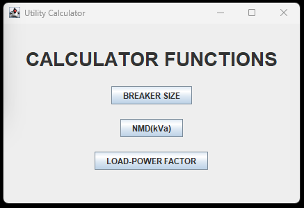
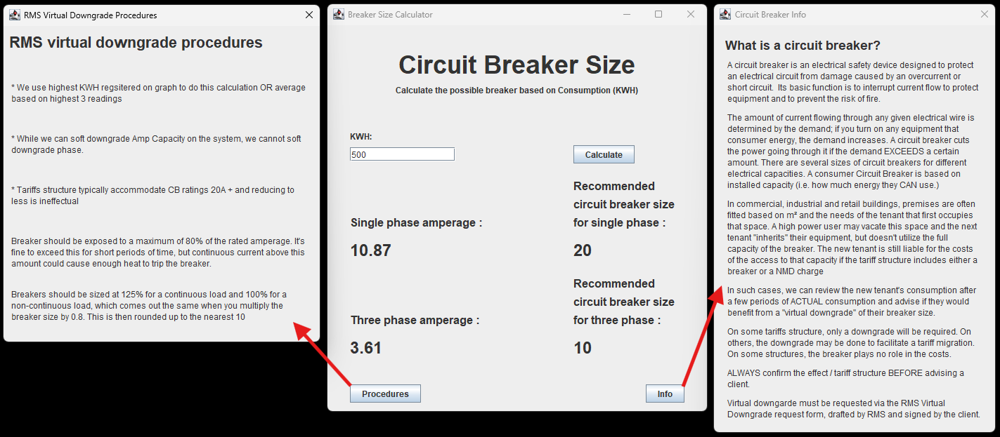
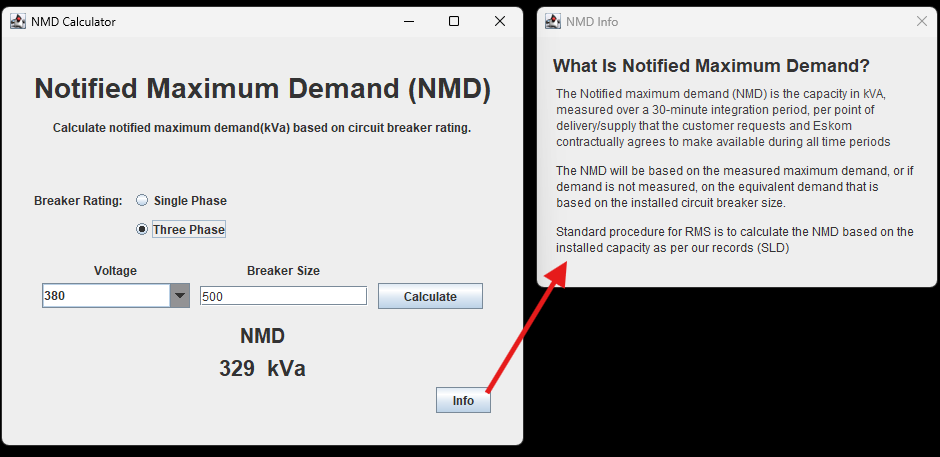
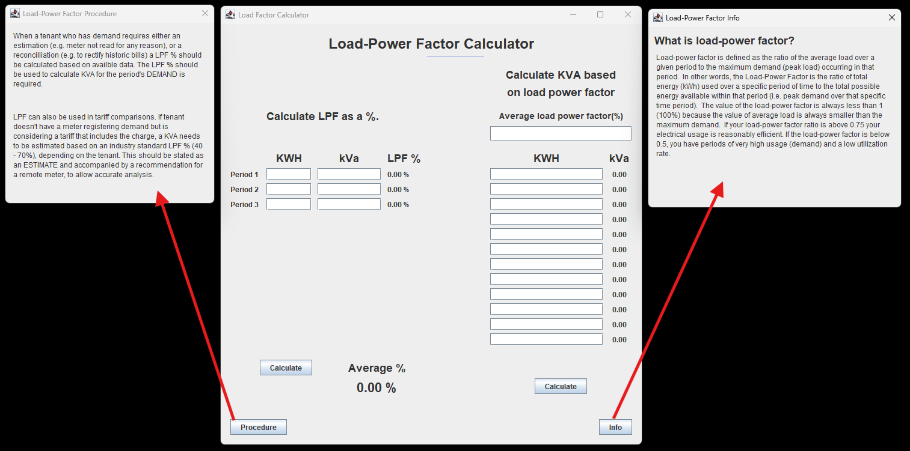

# Utility Billing Calculator

A desktop calculator built with Java and Swing, developed as a trial project for Remote Metering Solutions in February 2023 — the project that led to my hire.

## What it does

Assists utility account managers with common electrical calculations, including:
- Circuit breaker sizing

- kVA calculations

- Power factor analysis

## Background

RMS provided the business logic and specification; I built the application and interface from that spec, focused on making the tool usable for non-technical utility account managers. This project led directly to a full-time offer, followed by a move into Data Analytics (Python, Pandas, Power BI) and then Systems Development.

## Tech

- Java
- Swing (GUI)

## Notes

This was an early trial project rather than a production system — kept here as a record of where things started.
